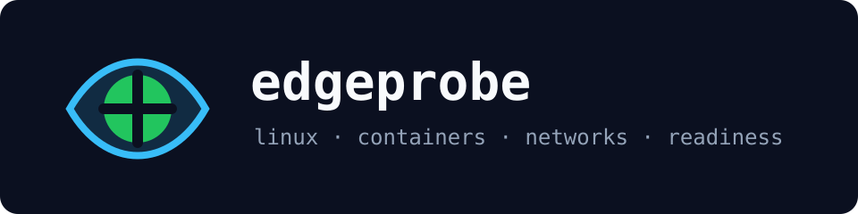

# edgeprobe



> From "the Linux edge node is weird" to driver, container, network, and readiness signals in one command.

Python command-line tool for Linux systems, container orchestration, and full-stack network triage. It analyzes captured host snapshots from `/proc`, `dmesg`, `ip`, `ss`, Docker, Kubernetes events, and wireless telemetry, then produces an operator-readable report or JSON for CI.

Built to demonstrate hands-on depth across Linux internals, Docker/Kubernetes, Python automation, Bash, Ansible, networking, device-driver debugging, heterogeneous GPU/CPU systems, CI/CD, and cellular/WiFi readiness.


## Business impact

No standard tooling exists for triaging Linux edge device readiness before deploying 5G/6G workloads: engineers spend hours on manual checks per site. edgeprobe runs a full readiness audit in seconds and exits non-zero in CI when a node fails, blocking broken deployments before they reach the fleet. Target buyers: telco operators, OEM edge platform teams, and systems integrators running O-RAN deployments at scale.

---

## What it looks like in practice

```bash
$ edgeprobe analyze tests/fixtures/host-snapshot

────────────────────────────────────────────────────────────
  edgeprobe
────────────────────────────────────────────────────────────
  ✗  ACTION REQUIRED
  snapshot:   host-snapshot
  kernel:     6.6.32-edge-rt
  confidence: 98%

  SUMMARY
  2 critical and 3 warning signal(s) found across Linux edge readiness checks.

  SIGNALS
  - CRITICAL · device_driver
    Kernel or device-driver instability detected
    evidence: [  144.712340] ixgbe 0000:5e:00.0 eth0: tx queue 3 timeout, resetting adapter
    fix: Capture dmesg with monotonic timestamps, compare driver/firmware versions, and isolate DMA/IRQ pressure before redeploying the workload.

  - CRITICAL · container_orchestration
    Kubernetes readiness is blocking delivery
    evidence: Warning  Unhealthy          pod/video-ingest-7c5c  Readiness probe failed: HTTP probe failed with statuscode: 503
    fix: Correlate pod events with node pressure, image pulls, readiness probes, and container runtime logs before rolling forward.
────────────────────────────────────────────────────────────
```

Use JSON when Jenkins, GitHub Actions, or another delivery system needs to archive the result:

```bash
edgeprobe analyze tests/fixtures/host-snapshot --output json
```

---

## Architecture

```
/proc, dmesg, ip, ss, Docker, Kubernetes, WiFi, cellular
          │
          ▼
┌─────────────────────────────────────────────────────────┐
│                       edgeprobe                         │
│                                                         │
│  ┌──────────────────┐   ┌────────────────────────────┐  │
│  │ Snapshot loader  │   │ Fixture/collector contract │  │
│  │ pathlib + types  │   │ portable text artifacts    │  │
│  └────────┬─────────┘   └────────────┬───────────────┘  │
│           └──────────────┬───────────┘                  │
│                          ▼                              │
│  ┌───────────────────────────────────────────────────┐  │
│  │ Classifier                                         │  │
│  │ Linux driver, network, K8s, Docker, GPU, wireless │  │
│  │ rules with deterministic confidence scoring        │  │
│  └──────────────────────┬────────────────────────────┘  │
│                         ▼                               │
│  ┌───────────────────────────────────────────────────┐  │
│  │ Reporters                                          │  │
│  │ Terminal for operators · JSON for CI/CD pipelines │  │
│  └──────────────────────┬────────────────────────────┘  │
│                         ▼                               │
│       Jenkins / GitHub Actions / Kubernetes DaemonSet    │
└─────────────────────────────────────────────────────────┘
```

---

## Skills demonstrated

| Job signal | Where it shows up |
|---|---|
| Linux internals and system debugging | `dmesg`, kernel release, boot cmdline, IRQ/DMA/driver timeout rules |
| Docker and Kubernetes | `Dockerfile`, `k8s/daemonset.yaml`, Kubernetes event triage, Docker health parsing |
| Python/Bash automation | Typed Python package plus `scripts/make_demo.sh` |
| Infrastructure provisioning | `ansible/playbooks/linux-edge-readiness.yml` captures and runs snapshots |
| Full-stack networking | Route, socket, MTU/CNI, TCP retransmission, OS-to-service reasoning |
| Device drivers | `ebpf/packet_latency_kprobe.c` and driver timeout/Xid/PCIe detection |
| Real-time and embedded systems | RT kernel fixture, isolated CPU boot flags, latency-focused remediation |
| GPU/CPU heterogeneous systems | GPU inventory detection and device-plugin readiness guidance |
| CI/CD delivery | `Jenkinsfile` plus GitHub Actions workflow and archived JSON reports |
| Cellular and WiFi | RSRP/RSRQ/SINR/WLAN roam telemetry classification |

---

## Install

```bash
git clone https://github.com/gerardrecinto/edgeprobe.git
cd edgeprobe
python3 -m pip install -e .
```

---

## Usage

```bash
# Analyze included fixture
edgeprobe analyze tests/fixtures/host-snapshot

# Machine-readable report
edgeprobe analyze tests/fixtures/host-snapshot --output json

# Run without installing
PYTHONPATH=src python3 -m edgeprobe analyze tests/fixtures/host-snapshot
```

---

## Snapshot contract

`edgeprobe` reads plain text artifacts so it can run in CI without privileged host access:

| File | Typical source |
|---|---|
| `kernel_release.txt` | `uname -r` |
| `proc_cmdline.txt` | `/proc/cmdline` |
| `proc_cpuinfo.txt` | `/proc/cpuinfo` |
| `lspci.txt` | `lspci` |
| `dmesg.log` | `dmesg -T` or journal export |
| `ip_addr.txt` | `ip addr` |
| `ip_route.txt` | `ip route` |
| `ss.txt` | `ss -tinp` |
| `kube_events.log` | `kubectl get events -A` |
| `docker_ps.txt` | `docker ps --format ...` |
| `wireless.log` | modem/WiFi telemetry export |

---

## CI/CD

The included `Jenkinsfile` runs unit tests, builds a Docker image, executes the golden snapshot analysis, and archives the JSON result:

```groovy
stage('Analyze Golden Snapshot') {
    steps {
        sh 'PYTHONPATH=src python3 -m edgeprobe analyze tests/fixtures/host-snapshot --output json > edgeprobe-report.json || test $? -eq 2'
        archiveArtifacts artifacts: 'edgeprobe-report.json', fingerprint: true
    }
}
```

---

## Test

```bash
PYTHONPATH=src python3 -m unittest discover -s tests
```
